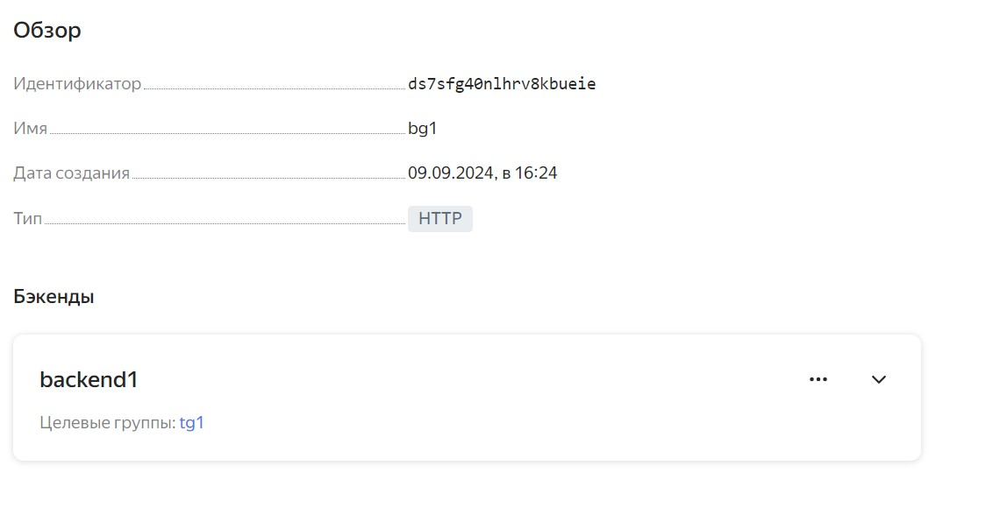

# Дипломная работа по профессии «Системный администратор» - Степанов Владислав
  
Задание:[Дипломная работа](https://github.com/netology-code/sys-diplom/tree/diplom-zabbix?tab=readme-ov-file#%D0%B7%D0%B0%D0%B4%D0%B0%D1%87%D0%B)
  
## Инфраструктура

### Terraform

Для развёртки инфраструктуры были использованы Terraform и Ansible.\
*Описание инфраструктуры находится в файле terraform/main.tf\
\
Был создан каталог далее разворачивание происходило при помощи terraform.\

\
Созданные ВМ
\

Используемая конфигурации VM:2 ядра 20% Intel ice lake, 2-4Гб памяти, 10hdd, прерываемая.\

### Ansible

Инвентарь хостов из FQDN\
\

\
Проверка доступности\
\

## Сайт

Созданы две ВМ в разных зонах, с установленым на них сервером nginx и был настроен балансировщик\

### Настройка веб-серверов nginx на ВМ

Плейбук:[nginx.yml](./ansible/nginx.yml)

### Страничка сайта

### Настройка балансировщика

#### Создан Target Group

#### Создан Backend Group

#### HTTP router

#### Создан Application load balancer

`Тестируем сайт curl -v <публичный IP балансера>:80`

Лог балансировщика

## Мониторинг

### Zabbix сервер

#### Устанавливаем сервер по средством ansible

Плейбук:[zabbix_server.yml](./ansible/zabbix_server.yml)

#### Установиваем Zabbix Agent на каждую ВМ и настраиваем агенты на отправление метрик в Zabbix.

Плейбук:[zabbix_agent.yml](./ansible/zabbix_agent.yml)

Пример дашборда:

## Логи

### Разверачиваем Elasticsearch

Плейбук:[elasticsearch.yml](./ansible/elasticsearch.yml)

### Разверачиваем filebeat на web серверах

Плейбук:[filebeat.yml](./ansible/filebeat.yml)

### Разверачиваем kibana

Плейбук:[kibana.yml](./ansible/kibana.yml)

#### Kibana

## Сеть

### VPC

Развернута VPC.\
Сервера web, Elasticsearch поместите в приватные подсети.\
Сервера Zabbix, Kibana, application load balancer определите в публичную подсеть.\

## Резервное копирование

snapshot дисков создаются для всех ВМ. Время жизни snaphot неделя. snaphot настроены на ежедневное копирование.

